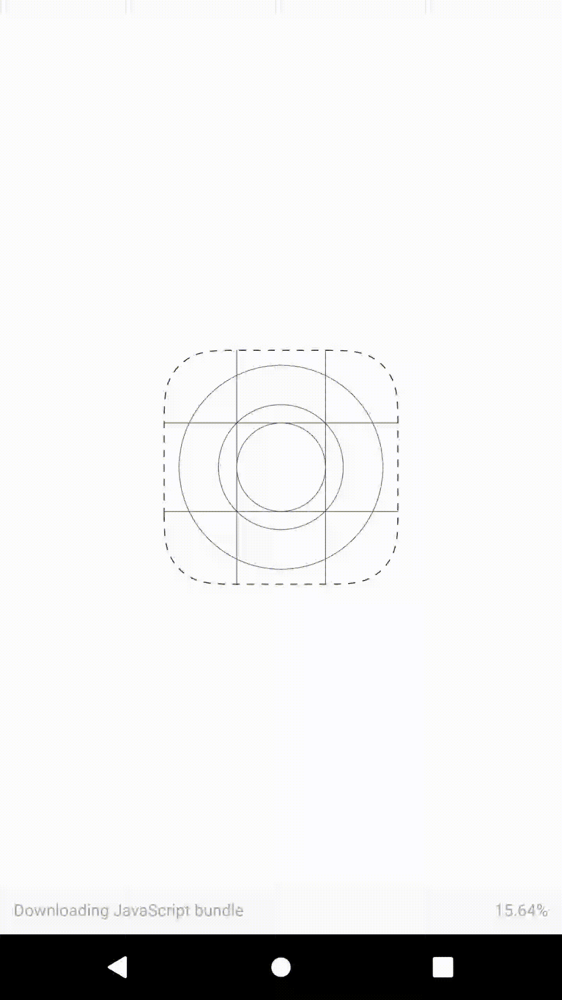

<h1>React Native Swipeable FlatList</h1>


You can clone the repository and use the following commands:

##### Run code
```shell
npm install -g expo-cli
```

##### Run code
```shell
npm install
```

##### Run code
```shell
expo start
```

